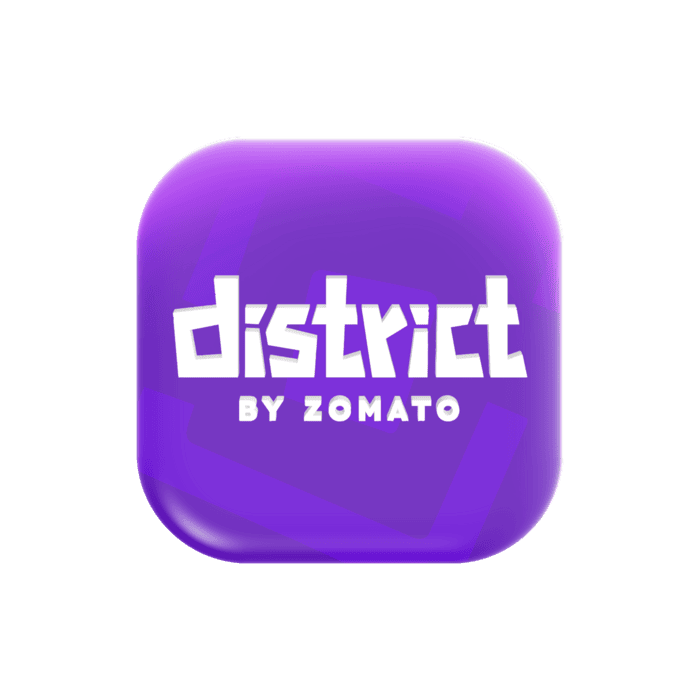
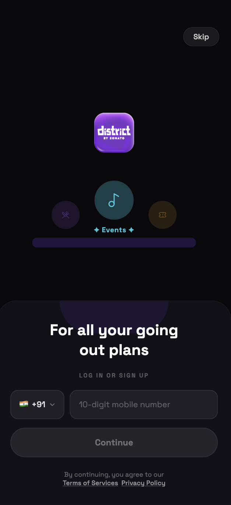
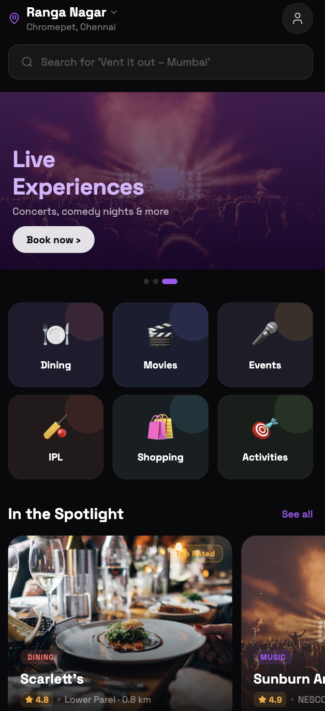
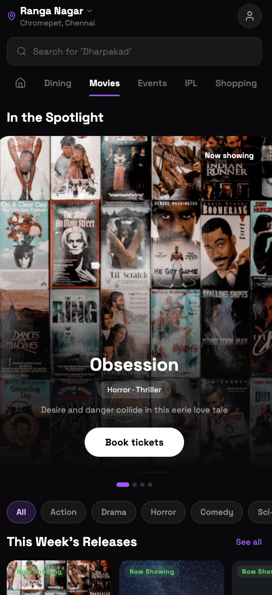
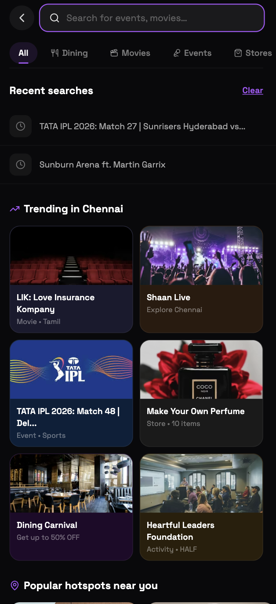
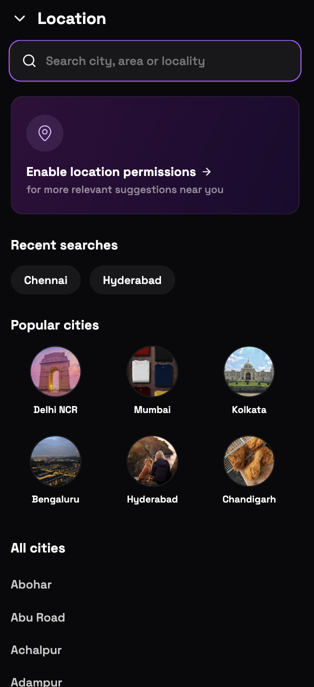
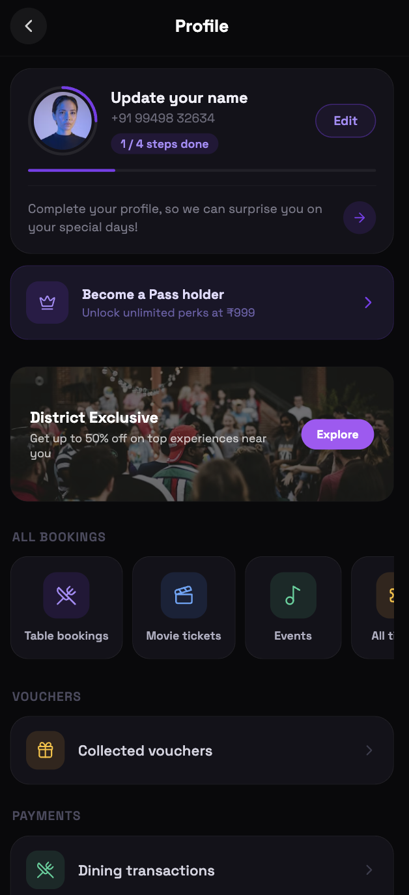

<!-- Centered Premium Header -->
<p align="center">
  
</p>

<h1 align="center">Zomato District Clone</h1>

<p align="center">
  <strong>A pixel-perfect, high-fidelity mobile application clone of Zomato District built with cutting-edge mobile technologies.</strong>
</p>

<p align="center">
  
  
  
  
</p>

---

## 📱 Interactive Showcases

<p align="center">
  
  
  
  
  
  
</p>

---

## ✨ Features

- 🎨 **Unified Design System**: Sleek hard dark-mode background (`#09090B`), Harmonious purple accent system (`#A855F7`), and premium custom Typography utilizing the `SpaceGrotesk` font family.
- ⚡ **Interactive Focus UX**: Timing-based spring focus animations on input components with glowing custom shadow overlays, animated search icon highlights, and micro-scaling transitions.
- 🌐 **Web-Clipped Outlines**: Custom styled native inputs utilizing `outlineStyle: 'none'` to bypass generic browser outlines on React Native Web.
- 🌆 **Edge-to-Edge Horizontals**: Screen containers redesigned to allow filter lists, hotspots, and movie carousels to scroll dynamically border-to-border while static content maintains proper safe areas.
- 🗺️ **High-Fidelity Cities Selector**: Curated circular travel thumbnails representing popular city monuments instead of standard placeholder icons.
- 👤 **District Exclusive Dashboard**: Fully styled profile screen with real user avatar renders and interactive concert explore banners.

---

## 📁 Architecture & Structure

```text
.
├── app/                  # Expo Router navigation routing system
├── src/                  # Main source code
│   ├── components/       # Reusable shared components (CategoryPageHeader, MovieCard)
│   ├── constants/        # Global tokens, theme colors, and layout templates
│   ├── hooks/            # Dedicated application React hooks
│   ├── context/          # State wrappers (React context)
│   ├── types/            # Strict TypeScript structures
│   └── utils/            # Shared helper functions
├── assets/               # Local media assets (icons, custom fonts, snapshots)
├── app.json              # Main Expo app settings
├── eas.json              # EAS cloud build specs
└── tsconfig.json         # TS compile aliases mapping
```

---

## 🚦 Getting Started

### Prerequisites

Ensure you have **Node.js** (LTS) installed on your system alongside **npm** or **yarn**.

### Installation

1. Clone the repository and navigate inside:
   ```bash
   cd zomato-district-clone
   ```
2. Install the production dependencies:
   ```bash
   npm install
   ```

### Launching Development Server

Run the Expo dev script to start:

```bash
npx expo start
```

- Press `i` to boot on **iOS Simulator**.
- Press `a` to boot on **Android Emulator**.
- Press `w` to boot on **Web Browser**.
- Scan the printed QR code using the **Expo Go** application on your physical mobile device.

---

## 🏗 Build & Deploy (CNG & EAS)

This project uses **Continuous Native Generation (CNG)**. Custom native builds are handled automatically in the cloud through **Expo Application Services**.

### Dev Builds

```bash
eas build --profile development --platform ios
# or
eas build --profile development --platform android
```

### Production Builds

```bash
eas build --profile production --platform ios
# or
eas build --profile production --platform android
```

---

## 📝 License

This project is for demonstration and UX showcase purposes.
